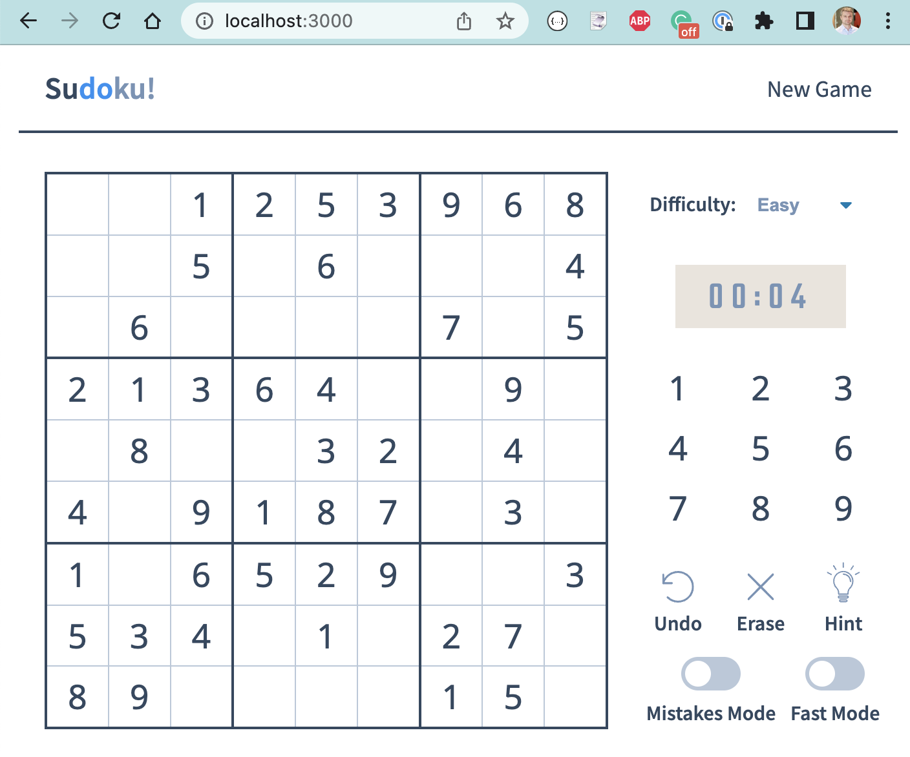
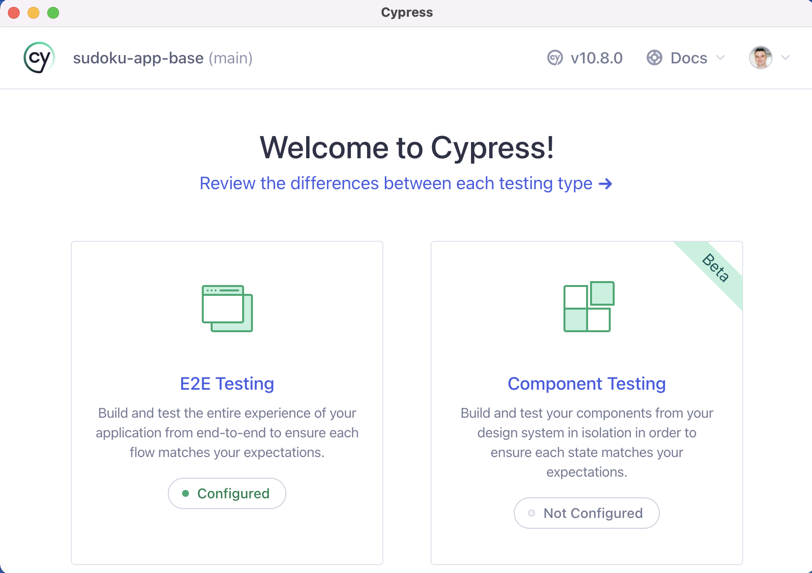

# sudoku-app-base [](https://github.com/bahmutov/sudoku-app-base/actions/workflows/ci.yml) 

> Example Sudoku React application used for "Testing for Good" Cypress workshop


The example application is used during my [Cypress v10 Fundamentals](https://cypress.tips/courses) free course.

Original Sudoku game copied from [https://github.com/raravi/sudoku](https://github.com/raravi/sudoku) and you can play it at [https://sudoku-raravi.vercel.app/](https://sudoku-raravi.vercel.app/).



## Requirements

You need Node v14+ installed on your local machine. You can check by running:

```
$ node -v
v16.14.0
$ npm -v
8.11.0
```

Clone the repository to your local machine and install its dependencies

```
$ git clone git@github.com:bahmutov/sudoku-app-base.git
$ cd sudoku-app-base
$ npm install
```

Check the application starts, and verify the application works at the URL `localhost:3000`

```
$ npm start
$ open localhost:3000
```

Check if Cypress opens

```
$ npx cypress open
```

If you see the dialog below, you are good to go!



## Small print

Author: Gleb Bahmutov &lt;gleb.bahmutov@gmail.com&gt; &copy; 2022

- [@bahmutov](https://twitter.com/bahmutov)
- [glebbahmutov.com](https://glebbahmutov.com)
- [blog](https://glebbahmutov.com/blog)
- [videos](https://www.youtube.com/glebbahmutov)
- [presentations](https://slides.com/bahmutov)
- [cypress.tips](https://cypress.tips)
- [Cypress Tips & Tricks Newsletter](https://cypresstips.substack.com/)
- [my Cypress courses](https://cypress.tips/courses)

License: [MIT](./LICENSE.md) - do anything with the code, but don't blame me if it does not work.

Support: if you find any problems with this module, email / tweet /
[open issue](https://github.com/bahmutov/sudoku-app/issues) on Github
